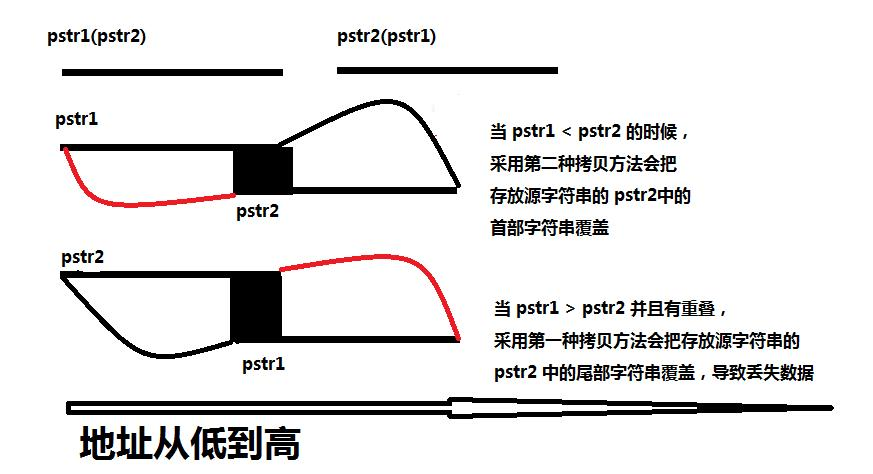

## 实现memcpy,考虑内存重叠(memmove)

```C
void *memcpy(void *dest, const void *src, size_t n) {
    assert(dest && src);

    char *pdest = (char *)dest;
    char *psrc = (char *)src;

    //当pdest< psrc时，即pdest的首地址小于psrc的首地址（图1），正序拷贝
    if (pdest < psrc) {
        for (size_t i = 0; i < n; ++i) {
            *pdest = *psrc;
            ++pdest;
            ++psrc;
        }
    } else {
    //当pdest> psrc时，即pdest的首地址大于psrc的首地址（图2），倒叙拷贝
        pdest += n - 1;
        psrc += n - 1;
        for (size_t i = 0; i < n; ++i) {
            *pdest = *psrc;
            --pdest;
            --psrc;
        }
    }
    return dest;
}
```



